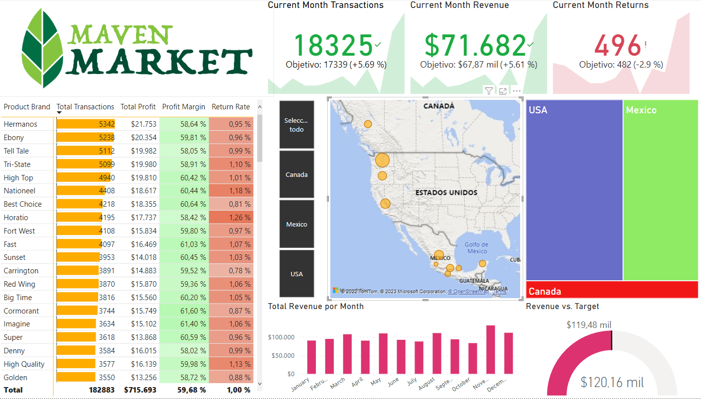

# Maven Market - Dashboard comercial en Power BI

Proyecto realizado como parte de un curso de Power BI. El objetivo fue construir un dashboard interactivo para analizar el desempeño comercial de Maven Market a partir de datos de ventas, productos, clientes, tiendas, regiones, calendario y devoluciones.

## Herramientas utilizadas

- Power BI
- Power Query
- Modelado de datos
- DAX básico
- Visualización de datos

## Datos utilizados

El proyecto integra distintas tablas:

- Calendario
- Clientes
- Productos
- Regiones
- Tiendas
- Transacciones de 1997 y 1998
- Devoluciones de 1997 y 1998

## Objetivo del análisis

Construir un dashboard que permita explorar indicadores comerciales relevantes, como ventas, ganancias, margen, transacciones y devoluciones, con posibilidad de segmentar la información por fecha, país, tienda, producto y cliente.

## Principales elementos del dashboard

- Indicadores KPI para resumir el desempeño comercial.
- Visualizaciones para analizar ventas y ganancias.
- Análisis por producto, marca, tienda y región.
- Seguimiento de devoluciones.
- Segmentadores para explorar los datos de forma interactiva.

## Estructura del repositorio

```text
maven-market-power-bi-dashboard/
├── data/
│   ├── MavenMarket_Calendar.csv
│   ├── MavenMarket_Customers.csv
│   ├── MavenMarket_Products.csv
│   ├── MavenMarket_Regions.csv
│   ├── MavenMarket_Returns_1997-1998.csv
│   ├── MavenMarket_Stores.csv
│   ├── MavenMarket_Transactions_1997.csv
│   └── MavenMarket_Transactions_1998.csv
├── images/
│   └── capturas del dashboard
├── Maven_Market_Report_COMPLETE.pbix
└── README.md
```

## Captura del dashboard




## Aprendizajes

- Integración de múltiples tablas en un modelo de datos.
- Limpieza y transformación de datos con Power Query.
- Creación de relaciones entre tablas.
- Construcción de indicadores y visualizaciones orientadas al análisis de negocio.
- Diseño de un dashboard interactivo para comunicar información comercial.
